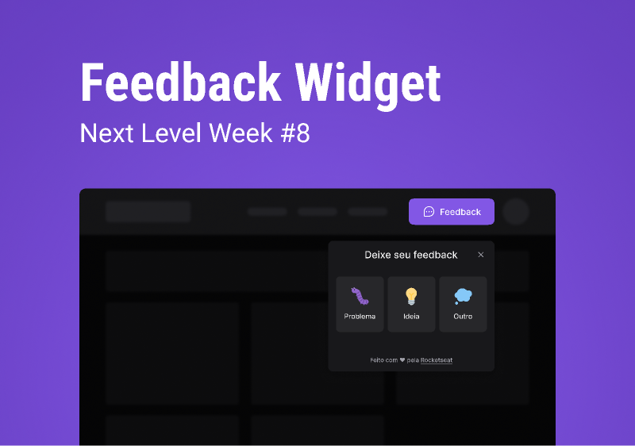
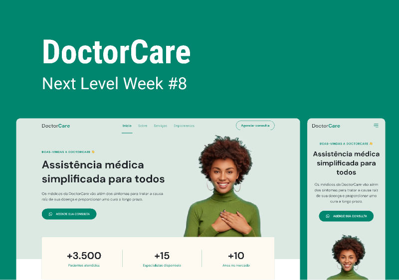

<h1 align="center">
  # Impluse
  # Origin
</h1>

  <a href="#-tecnologias">Tecnologias</a>&nbsp;&nbsp;&nbsp;|&nbsp;&nbsp;&nbsp;
  <a href="#-projeto">Projeto</a>&nbsp;&nbsp;&nbsp;|&nbsp;&nbsp;&nbsp;
  <a href="#-layout">Layout</a>

 
 

  
  

## ✨ Tecnologias

Esse projeto foi desenvolvido com as seguintes tecnologias:

### Web
- [Vite](https://vitejs.dev)
- [ReactJS](https://reactjs.org)
- [TypeScript](https://www.typescriptlang.org/)
- [TailWindCSS](https://tailwindcss.com)

### Server
- [Express](https://expressjs.com)
- [Prisma](https://www.prisma.io)
- [Nodemailer](https://nodemailer.com)

### Mobile
- [React Native](https://reactnative.dev)
- [TypeScript](https://www.typescriptlang.org/)
- [Expo](https://expo.dev)

## 💻 Projeto

O FeedbackWidget é widget para deixar feedback da aplicação.

O DoctorCare é um site.

## 🔖 Layout
